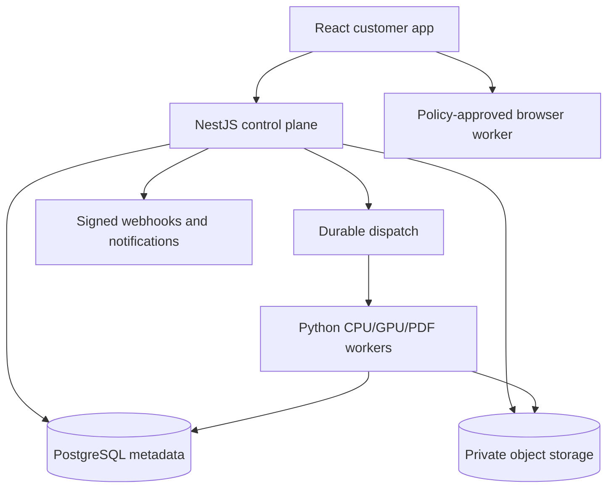
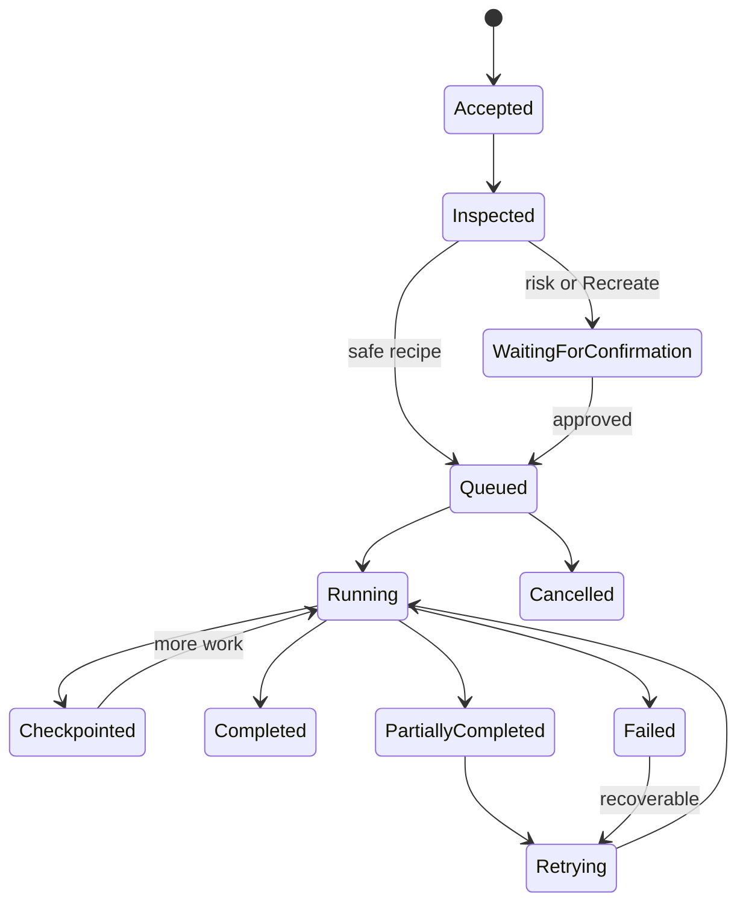

# Intelligent Visual Production Workspace

## Consolidated Product and Implementation Authority

**Status:** Approved grooming baseline for production implementation
**Version:** 2.0
**Date:** 30 August 2026
**Product owner:** Vijay Kumar Kamsala
**Repository baseline:** Recovery 1 production foundation, remote head `04380e38acfd771e896899dd8ea858d93303e93b`
**Immediate successor work:** Recovery 2A — Product Kernel and Real Workspace Foundation

---

## 1. Purpose and Authority

This document consolidates the approved product vision, customer experience, functional boundaries, architecture responsibilities, delivery order, quality rules and immediate Codex scope for Product V2.

Its purpose is to prevent four recurring failures:

1. Building a technically capable application that does not feel like a customer product.
2. Allowing a narrow scan-cleanup or image-to-PDF workflow to replace the broader product vision.
3. Mixing experimental benchmark code, legacy code and production runtime code.
4. Letting different agents repeatedly reinterpret already approved decisions.

### 1.1 Authority order

When documents or code disagree, use this order:

1. This `PRODUCT_V2_CONSOLIDATED_IMPLEMENTATION_AUTHORITY.md`.
2. A later product-owner-approved decision explicitly added to the Product V2 decision register.
3. Product V2 functional requirements, user flows, quality plan and recovery architecture documents.
4. Approved architecture decision records.
5. Earlier product documents and proof/benchmark documents.
6. Existing code, legacy UI and repository conventions.

Existing code is evidence and a reuse candidate; it is not permission to change the product definition.

### 1.2 Conflict rule

An implementation agent must not silently choose between contradictory sources. It must:

1. Identify the exact conflict.
2. Apply the authority order above when the resolution is unambiguous.
3. Record the reconciliation in the current work report.
4. Stop and request product-owner approval only when the conflict would materially change customer behaviour, privacy, security, commercial rights, data ownership or irreversible architecture.

### 1.3 Terms that must not control implementation

The following are not descriptions of the intended product:

- Image-to-PDF converter
- Scan-cleanup utility
- Collection of disconnected one-action tools
- Legacy workspace redesign
- Benchmark application
- Model demonstration
- YearShift sub-application

The product is a production-grade visual workspace. Small tools remain useful entry points, but they open focused views of the same coherent workspace and domain services.

---

## 2. Product Constitution

### 2.1 Product identity

Product V2 is an independent **Intelligent Visual Production Workspace** for creating, restoring, editing, managing, collaborating on, signing and producing images, graphics and PDFs.

It serves individuals, creative users, professional teams, factories, agencies, print businesses, textile businesses, document-heavy organisations and API customers without creating separate “individual” and “business” product architectures.

The product may later participate in a YearShift commercial umbrella through stable APIs, shared identity or shared billing. The product must not initially depend on YearShift authentication, database, billing, deployment or internal services.

### 2.2 Product promise

Customers should be able to bring an imperfect source, understand what is trustworthy, improve it without destroying the original, create multiple professional outputs and confidently use those outputs for either digital or physical purposes.

The system must distinguish between:

- **Preserving evidence:** deterministic changes that do not invent photographed content.
- **Restoring recoverable detail:** bounded reconstruction based on the source.
- **Recreating detail:** generative work that may invent or materially reinterpret content.

The product must never imply that increasing pixel dimensions automatically recreates original detail or guarantees a production-safe print.

### 2.3 Parent customer outcomes

The home experience presents these four outcomes equally:

1. **Image & Graphic Studio**
2. **Create PDF**
3. **Edit & Manage PDF**
4. **Print & Production**

Projects, files, collaboration, cloud connections, e-sign, API access and workspace administration support all four outcomes. They are not competing home-page product cards.

### 2.4 Pre-tester product boundary

Before external tester release, the product includes production-ready foundations for:

- The four parent outcomes.
- Guest intake and signed-in workspace experiences.
- Projects, default files, versions and non-destructive history.
- Collaboration, sharing, document locks, comments and optional approvals.
- Google Drive, Microsoft OneDrive/SharePoint and Dropbox connections.
- Native e-signature workflows and stable API access.
- Public API credentials, OAuth, asynchronous jobs, signed webhooks and diagnostics.
- Privacy, retention, deletion, legal holds, data-region controls and audited support access.
- Zero-charge shadow pricing and transparent non-monetary usage.
- Internal release gates, model/licence registry, feature flags, controlled cohorts and rollback.

Video creation or editing and live payment collection are excluded from this product boundary. They require separate grooming and architecture approval.

This boundary does not require every conceivable image, PDF or production feature before testing. It requires every **approved journey** to be complete, coherent, safe, tested and supportable. Experimental capabilities remain hidden behind release gates rather than appearing as unfinished menu items.

---

## 3. Customer Experience Principles

### 3.1 Outcome-first, workspace-complete

The home page explains what customers can accomplish. Once a file or document enters an editor, all relevant tools remain available. A customer who starts with Crop, Merge or Compress must not be trapped in a single-operation page.

### 3.2 Progressive complexity

Customers initially see:

- Intended outcome.
- Recommended correction or output.
- Strength or size.
- Trust, risk and production-readiness information.

Complete controls remain available under **Advanced** and through task-based workspaces. The product must not hide capability; it must reveal complexity when it becomes useful.

### 3.3 Originals are immutable

Uploaded originals, imported cloud versions and signed originals remain untouched. Every correction, edit, conversion, redaction, signature preparation and export creates recoverable state or a derivative.

### 3.4 Recommendations are not silent edits

The application analyses sources and may automatically generate a correction preview. Safe corrections apply only after customer confirmation. A Recreate operation always requires explicit permission.

### 3.5 Truthful quality communication

The product shows:

- Source dimensions and effective resolution.
- Intended physical or digital output size.
- Trustworthy size before invented reconstruction.
- Protected or reconstructed regions.
- Relevant production warnings.
- Compatibility and fidelity changes.

“4K”, “8K” and DPI are output properties, not proof that missing source detail was recovered.

### 3.6 Digital and physical outputs have equal importance

Digital correctness does not automatically guarantee physical correctness. Print and manufacturing introduce colour spaces, profiles, substrate behaviour, ink limits, minimum feature sizes, bleed, repeat, cutting and process-specific constraints. Digital outputs have their own compression, transparency, accessibility and platform constraints.

The same master document can produce both, but every output profile is independently preflighted.

### 3.7 Calm professional interface

The interface should feel capable without becoming crowded:

- Clear visible labels for primary actions.
- Search and **All Tools** always available.
- Task-based workspaces selected from the source and intended use.
- Movable, dockable and recoverable panels on desktop.
- A dockable AI conversation panel plus contextual AI actions on selections.
- A focused phone experience for review, capture, light correction, comments, approvals and signing—not a compressed imitation of every desktop control.

---

## 4. Guest and Signed-In Journeys

### 4.1 Guest entry

A guest may immediately:

- Drop or select an image or PDF.
- Start a blank graphic or PDF.
- Receive safe local/header-first inspection.
- See source facts, risks, likely intended use and recommended actions.
- Open the appropriate workspace and explore supported previews.

An account is required before:

- Durable project save or autosave beyond the temporary session.
- Cloud or long-running background processing.
- Connected-storage import or save-back.
- Collaboration or sharing.
- E-sign envelope sending.
- API credential creation.
- Final high-quality, production-approved or persistent export/download.

The sign-in boundary must preserve the guest's temporary work and return them to the same context.

### 4.2 Signed-in home

The signed-in home prioritises:

1. Continue recent work.
2. Create using the four equal parent outcomes.
3. Review items requiring attention: approvals, comments, cloud conflicts, e-sign and preflight warnings.
4. Monitor durable background jobs.
5. Access shared work and connected-storage activity.

It must not become a metrics-heavy administrator dashboard.

### 4.3 Default files

Every account receives a personal workspace and a default files location. Until a customer creates or chooses a project, uploaded, cloned, generated or saved work goes to Default Files.

Customers may later move an item into a project without changing its immutable source identity or losing history.

---

## 5. Complete Navigation Model

### 5.1 App-wide navigation

| Destination | Customer purpose |
| --- | --- |
| Home | Continue work, start one of the four outcomes, see attention items and job status |
| Projects | Browse collections, projects, subprojects and project-specific activity |
| Files | Default Files, workspace assets, imports, variants, versions and recovered items |
| Shared | Items shared with the customer, app-native links and pending invitations |
| Jobs | Background processing, exports, connector sync and retry/cancellation status |
| Sign | Envelopes, templates, recipient actions, evidence and completed packages |
| Developer | API credentials, OAuth clients, jobs, webhooks, logs and documentation |
| Notifications | Comments, approvals, conflicts, completion, failures and signing events |
| Workspace settings | Members, roles, policies, connections, usage, retention, regions and support access |

Search is app-wide and can find projects, files, versions, comments, jobs, envelopes and permitted shared items.

### 5.2 Home outcomes

| Outcome | Primary starts |
| --- | --- |
| Image & Graphic Studio | Upload image, open recent graphic, blank canvas, choose output intent |
| Create PDF | Quick from files/images, blank document, template, advanced page setup |
| Edit & Manage PDF | Open PDF, merge/split/organise, edit content, forms, redact, repair or convert |
| Print & Production | Open a design, choose production intent/profile, preflight, compare and export |

### 5.3 Project organisation

The product supports both project styles:

- **Document-centred:** a project represents one principal document/design plus versions, assets, outputs and discussions.
- **Folder-centred:** a project contains many independent files and subprojects.

Collections group projects without changing project ownership. Subprojects may inherit or override permissions and policies.

### 5.4 Editor boundaries

There are two primary editor foundations:

1. **Image & Graphic Studio** for raster images, vectors, text, shapes, multiple artboards, layout and graphical production.
2. **PDF Workspace** for creating and editing multi-page PDFs, managing imported PDFs, forms, links, signatures, accessibility, redaction and document production.

Print & Production uses the correct editor canvas plus a shared production-preflight and Export Center. It is not a third incompatible canvas implementation.

Create PDF and Edit & Manage PDF open the same PDF Workspace with different task-focused starting states.

---

## 6. Product Domain Model

The following concepts are first-class product entities. Names may change only through an approved contract decision.

| Entity | Responsibility |
| --- | --- |
| Workspace | Ownership, region, policies, members, connections, usage and retention boundary |
| Membership | User-to-workspace role and explicit grants |
| Project | Container for documents, files, assets, policies, collaboration and outputs |
| Collection | Optional grouping of projects with inheritable access |
| Project policy | Approval, retention, production, collaboration and connection rules |
| Asset original | Immutable source bytes plus validated identity and facts |
| Source version | New source supplied externally or internally without overwriting earlier sources |
| Document | Native editable image/graphic or PDF workspace document |
| Document version | Durable autosave or named document state |
| Artboard or page | Independently sized editable surface within a document |
| Layer | Raster, vector, text, shape, group, mask, adjustment, form or other editable object |
| Variant | Named alternative derived from a source or accepted AI result |
| Adjustment/mask | Non-destructive operation stored separately from original pixels |
| Recipe | Versioned set of processing operations and parameters |
| Processing job | Durable asynchronous execution record |
| Checkpoint | Recoverable, idempotent unit of durable work |
| Output profile | Versioned digital, print or manufacturing requirements |
| Export request/result | Independently preflighted, reproducible generated output |
| Provenance record | Source, processor, model, parameters, consent and reconstruction history |
| Comment thread | Version/region-anchored collaboration record |
| Approval | Optional project/workspace-controlled decision before production export |
| Lock lease | Renewable edit right for one document/file, not the entire project |
| Share link | Revocable, scoped, auditable application-native access grant |
| Cloud connection | Personal or admin-managed provider authorisation with least privilege |
| Cloud object reference | Provider item/version identity without treating the provider as our database |
| E-sign envelope | Immutable signing transaction derived from an approved document version |
| Recipient/field/event | Signing route, required input and auditable lifecycle evidence |
| Usage event | Non-monetary usage plus admin-only shadow cost calculation |
| Retention policy/legal hold | Rules controlling trash, purge and protected records |
| Audit event | Immutable security, policy, support and administrative evidence |

### 6.1 Non-destructive invariants

- Original object bytes never change.
- A source replacement creates `SourceVersion`, never an overwrite.
- Normal edits create adjustment/layer/document state, not destructive pixel rewrites.
- Accepted AI output creates a named variant or layer and preserves the prior state.
- Export creates a result; it does not become the editable master automatically.
- Permanent redaction creates a verified sanitised derivative while retaining the protected source according to policy.
- A signed or certified PDF remains protected; editable work occurs in a clearly labelled unsigned derivative.
- Cloud save-back creates a new provider file/version by default. Replacement requires permission and confirmation.

---

## 7. Image & Graphic Studio

### 7.1 Source analysis

On intake, the product performs header-first safety inspection before full decoding where possible. Analysis may identify:

- Dimensions, colour profile, alpha/transparency and orientation.
- Estimated decoded memory and safe processing route.
- Compression damage, blur, noise, exposure, glare, shadow and colour cast.
- Photographed or scanned document characteristics.
- Text, face, logo, line-art, fabric/pattern and mixed-content regions.
- Source metadata and sensitive GPS information.
- Likely intended use when inferable.

The application asks about intended use only when the answer materially changes processing or output requirements.

### 7.2 Correction modes

| Mode | Behaviour | Permission |
| --- | --- | --- |
| Preserve | Deterministic corrections, resampling and layout changes that do not invent photographed detail | Customer confirms recommended preview |
| Restore | Bounded recovery of likely detail with protected regions and recorded provenance | Customer confirms preview; reconstructed areas remain reviewable |
| Recreate | Generative replacement or substantial reconstruction that may invent detail | Explicit permission before processing and confirmation before production export |

The router chooses the safest appropriate mode. It must never silently escalate to Recreate.

### 7.3 Mixed-content processing

A single image may contain text, faces, logos, edges, gradients, fabric, photography and transparent regions. The product segments or masks these regions and applies compatible processing per region.

Protected regions are visible. Text, logos, outlines, identity-bearing faces and deliberate texture must not be globally smoothed by a photograph-oriented algorithm.

### 7.4 Required editing capabilities

The studio includes a coherent tool catalogue rather than disconnected pages:

- Resize using pixels, percentages, physical size, DPI and output profiles.
- Crop with free, standard, document and custom aspect ratios.
- Rotate, flip, straighten, perspective correction and page dewarping.
- Brightness, contrast, exposure, highlights, shadows, white balance, saturation and colour correction.
- Sharpen, denoise, deblur and compression-artifact treatment.
- Scan/document cleanup with glare, shadow and colour-cast correction.
- Background removal and replacement when commercially approved.
- Face restoration, damage repair and colourisation only when release-gated and licensed.
- Watermarking, privacy blur and metadata control.
- Raster-to-vector tracing with compatibility and quality reporting.
- Text, rich text, vector, shape, image, group, mask and adjustment layers.
- Alignment, distribution, guides, grids, snapping, rulers, measurement and safe areas.
- Layer naming, grouping, ordering, visibility, locking, blend and opacity.
- Multiple artboards with independent sizes and shared assets/styles.
- Smart Resize that creates a new artboard, proposes rearrangement and preserves the original.
- Linked or independent copies; workspace brand assets are linked by default.

### 7.5 AI result review

- Reconstructed regions are highlighted and inspectable.
- Critical regions may produce two or three quick candidates before full rendering.
- The selected result becomes a new named variant/layer.
- The source and earlier results remain available.
- Production export requires confirmation of material reconstruction.
- AI provenance records model/weight identity, version, parameters, route, consent and masks.

### 7.6 Trustworthy output size

When a requested physical size cannot be produced reliably from the source, the product must:

1. Show the largest trustworthy size for the selected profile.
2. Explain the limiting regions and effective resolution.
3. Offer a different output size/profile.
4. Separately offer explicit Restore or Recreate options when approved.

It must not present an 8K canvas as proof of microscopic detail.

---

## 8. Unified PDF Workspace

### 8.1 One editor, several entry paths

Quick Create PDF, advanced creation, Merge, Split, Remove Pages, Organise, Compress, OCR, Redact and Edit PDF open task-focused views of the same PDF Workspace. The customer may reveal all PDF tools without restarting or re-uploading.

There is no separate PDF creation editor inside the Image Studio.

### 8.2 Native document capabilities

New documents preserve these as independent editable objects:

- Rich text, paragraphs, columns and sections.
- Images, vectors, shapes, lines, backgrounds and groups.
- Tables with structured rows/cells and accessible headers.
- Headers, footers, page numbers and section-aware master pages.
- Links, bookmarks and navigation.
- Form fields, validation, calculated fields and submission behaviour.
- Signature, initials, name, date and acceptance fields.
- Layers, page templates and reusable components.

One document size is the default. Per-page sizes are allowed. **Normalize pages** creates a preview and avoids destructive cropping.

### 8.3 Scanned and photographed pages

When a photographed or scanned page is added:

1. Preserve the visual source.
2. Generate a proposed correction preview.
3. Generate an OCR proposal.
4. Ask before applying either.
5. Store searchable OCR text as a separate layer aligned to the visual page.
6. Flag low-confidence text regions.
7. Create an editable reconstructed layout only when explicitly requested.

OCR output must not silently replace the visual evidence.

### 8.4 Accessibility

The product automatically proposes document structure, reading order, headings, table semantics, form labels, language and tags. Accessibility preflight asks the customer only for missing human meaning such as alt text, intended heading semantics or ambiguous reading order.

Accessible PDF, screen PDF, small PDF, print PDF and archival PDF are independently preflighted exports from the same native master.

### 8.5 Imported PDF preservation

When content cannot be edited safely:

- Preserve supported native objects.
- Identify unsupported, restricted or uncertain objects.
- Offer safe page-level operations.
- Offer an explicit reconstructed copy when appropriate.
- Never silently flatten the entire file.

Edits rewrite only required objects where technically safe; unaffected objects are preserved. Export reports unavoidable compatibility changes.

### 8.6 Fonts

Font handling follows this order:

1. Use legally embedded fonts according to their embedding rights.
2. Use a matching installed or workspace-licensed font.
3. Offer a verified open/licensed font from an approved provider.
4. Offer substitution with visual comparison and recorded change.
5. Preserve appearance without editable text when editing rights or font bytes are unavailable.

The product may download a font on demand only from an approved source with verified redistribution/use terms. It must not scrape arbitrary font files or imply that every font can legally be downloaded.

### 8.7 PDF management and safety

The PDF Workspace includes:

- Merge, split, extract, delete, reorder, duplicate, rotate and crop pages.
- Add page numbers, headers, footers, watermarks, backgrounds and stamps.
- Purpose-based compression with predicted size and visual comparison.
- Repair that creates a recovered derivative plus a page/object recovery report.
- PDF-to-image and image-to-PDF.
- Verified conversions to/from supported office or structured formats, with page-level fidelity reporting.
- PDF/A, accessible and other approved conformance profiles.
- Password-authorised unlock that creates a decrypted derivative.
- Sandboxed safe mode for JavaScript, automatic actions, risky attachments or active content.
- Permanent redaction: mark/review non-destructively, render a sanitised derivative, then verify removed content is absent from bytes, metadata, hidden objects and attachments.

The custom PDF package remains quarantined for production use until the approved compatibility, differential, fuzz, security, large-document, signature, font, form, tag and viewer/printer benchmark passes.

### 8.8 Signed PDFs and recipient input

- A digitally signed/certified original is protected.
- Permitted edits occur in an unsigned derivative with an explicit warning.
- Recipient completion links open a focused PDF preview with only assigned fields editable.
- Recipients can enter name, date, text, choices, initials and signature according to the envelope.
- After successful submission, that recipient action becomes read-only.
- Corrections require an authorised correction flow, reissue or new envelope state; the prior evidence remains auditable.

### 8.9 Dynamic PDF generation boundary

The architecture must support later-approved requirements for API-driven templates, variables, conditional content, repeating sections, tables, data binding and batch generation without bypassing the native document model.

Those features are part of the intended product, but their detailed grammar, validation rules, data-source security and designer experience require a dedicated approved specification before implementation. Until then, do not invent a template language.

---

## 9. Print & Production

### 9.1 Role in the product

Print & Production appears as an equal home outcome and as contextual preflight/export capability inside the editors. It serves textile and other manufacturing use cases without making the overall product textile-only.

### 9.2 Profiles

The product provides:

- Researched built-in baseline profiles.
- Versioned workspace profiles.
- Editable factory profiles for machine, ink/toner, material/substrate, process and finishing combination.
- Digital platform profiles maintained as versioned built-ins plus workspace custom profiles.

Profile updates do not silently change an already approved export. The customer is notified and may re-preflight using the new version.

### 9.3 Preflight

Preflight may evaluate:

- Effective resolution at actual output size.
- Colour space, embedded profile, conversion intent and gamut risk.
- Transparency, flattening compatibility and overprint rules where relevant.
- Bleed, trim, safe area and cut paths.
- Minimum text, line, gap and isolated-mark dimensions.
- Missing/unsupported fonts and object effects.
- Spot colours, separations, palette limits and ink/coverage constraints where relevant.
- Repeat/tile seams, pattern alignment and artboard dimensions.
- Background/transparency expectations.
- Page boxes, PDF conformance and printer/viewer compatibility.
- Reconstructed AI regions and outstanding confirmations.

A critical failure withholds the **Production-ready** approval. An authorised customer may export with a recorded reason unless the selected profile is configured as strict.

### 9.4 Sample and swatch workflow

Physical sample approval is optional and customer-controlled. The SaaS does not claim to inspect a physical output automatically.

When useful, a project can record:

- Sample requested/printed.
- Machine, material, ink and profile used.
- Photo or scan of the result.
- Observed colour/detail issue.
- Customer/factory approval or rejection.
- Corrective profile note.

This creates traceability and helps a factory improve repeatability. It is not a mandatory condition for every export.

### 9.5 Export Center

One primary **Export** action opens the Export Center. Customers can:

- Select multiple output profiles, sizes and formats in one job.
- Preview at target digital sizes and physical dimensions.
- Compare visual quality and estimated file size.
- Export images, PDFs, SVG or other approved formats.
- Download individually or as a ZIP.
- Save to connected cloud storage.
- Share using application-native access.
- Quickly repeat the last approved preset.

Every output retains provenance, profile version, source/document version, processor versions and warnings.

---

## 10. Batch Processing

- Automatically group compatible files by source type, risk and recipe.
- Apply shared settings while showing visible per-file exceptions.
- Show representative previews for each compatible group.
- Require individual confirmation only for flagged risks and Recreate operations.
- Execute as durable background jobs.
- Allow customers to close the application.
- Preserve completed outputs when another item fails.
- Cancel pending items without deleting completed results.
- Retry from the last safe checkpoint.
- Produce per-file and group-level reports.
- Support 1, 10 and 50-file durability tests and enforce fair-use technical limits rather than hidden billing limits during testing.

---

## 11. Projects, Versions and Collaboration

### 11.1 Permissions

- Workspace and collection permissions inherit by default.
- A child project/subproject may explicitly override access.
- The UI shows where each permission originated.
- Project invitations may grant view, comment/review, edit, approve or manage access according to workspace policy.
- A customer may invite someone to one project, a group/collection or a subproject without exposing unrelated content.

### 11.2 Editing locks

Use a document/file-level renewable lease:

- One user edits a document at a time.
- Other users may view that document and edit other files in the same project.
- Autosave persists the editor's work.
- Disconnection keeps a short renewable lease and then releases it.
- Owners may request or force takeover with warning and audit.
- No silent last-write-wins overwrite is permitted.

### 11.3 Saving and history

- Continuous autosave.
- Persistent undo and redo across sessions within policy limits.
- Automatic durable versions at meaningful checkpoints.
- Customer-named versions.
- Save As for intentional forks.
- Compare and restore without deleting later history.
- Original and source versions remain visible.

### 11.4 Comments and approvals

- Comments anchor to exact document version, page/artboard and region/object.
- Unresolved threads may carry forward with traceable links.
- Resolved comments remain in history.
- Formal approval is optional and configured per project/workspace.
- Approval can be required before production export, e-sign sending or cloud save-back.
- A new material version may invalidate or request renewal of approval according to policy.

### 11.5 Application-native share links

Share links support:

- View, comment/review, download or edit scopes when policy permits.
- Version-pinned or always-current targets.
- Expiry, password, email/OTP verification and allowed-domain restrictions.
- Download/print controls.
- Optional recipient identity capture.
- Immediate revocation.
- Audit of creation, access, failed authentication and downloads.

Anonymous editing is disabled by default. Sensitive, production-approved, legally held and e-sign records may impose stricter workspace rules.

---

## 12. Connected Cloud Storage

### 12.1 Supported connections

- Google Drive.
- Microsoft OneDrive and SharePoint.
- Dropbox.

Connections may be personal or admin-managed workspace connections. Consent requests the least-privilege folder/file scope practical for the selected workflow.

### 12.2 Import and source identity

An imported provider object creates an immutable app source version plus a provider reference. The product records provider file identity and version metadata but does not treat a public/shared link as durable authorisation.

### 12.3 External changes

When a connected source changes externally:

1. Create a new source version.
2. Preserve current work.
3. Ask whether to rebase/replace the active source.
4. Offer **remember this rule** for that connection, folder or project.
5. Apply the remembered rule to later changes while remaining visible and reversible.

### 12.4 Save-back

Explicit **Save to cloud** creates a new file or provider version by default. Replacing an external file requires provider permission and customer confirmation.

Disconnecting a provider or deleting our app-managed copy never deletes external files automatically. The UI explains what remains in each system.

---

## 13. Native E-Sign

### 13.1 Ownership

The product owns its native e-sign architecture, UI and API. DocuSign, Adobe Acrobat Sign or other adapters are optional integrations, not the core implementation.

### 13.2 Envelope capabilities

- Prepare from an immutable approved document version.
- Add signer, approver, witness and copy-recipient roles.
- Sequential, parallel and mixed routing groups.
- Signature, initials, name, title, date, text, checkbox, choice and attachment fields according to policy.
- Sender-defined recipient authentication.
- Risk/jurisdiction-based authentication recommendations.
- Email link, OTP, identity and qualified-signing provider levels where supported.
- Reminders, expiry, decline, delegation policy, correction, void and reissue.
- Tamper evidence, consent evidence, timestamps, delivery/open/action events and completion certificate.
- Completed signed package retained according to explicit policy/legal hold.

Recipients do not need an application account. A secure link opens only their assigned signing experience.

The product must not advertise a legal assurance level that has not been validated for the applicable jurisdiction and identity/signature provider.

---

## 14. Accounts, Workspaces and Administration

### 14.1 Universal workspace model

- Every signup receives a personal workspace.
- The same workspace architecture supports a person, informal group or company.
- Customers may create/join additional workspaces.
- Workspace owns projects, policies, connections, usage and retention.
- “Individual” and “business” are commercial descriptions, not separate database entities.

### 14.2 Roles

Production contracts must support composable permissions. Initial customer-facing roles may include:

- Owner.
- Workspace administrator.
- Editor.
- Reviewer/approver.
- Viewer.
- Billing/usage viewer when later needed.
- Service account.
- External signer, which is envelope-scoped rather than a workspace member.

Do not hard-code business logic to three role names; enforce granular permissions and map friendly roles to them.

### 14.3 Workspace settings

- Members, groups and invitations.
- Default project/file behaviour.
- Sharing and approval policies.
- Processing route policy and Advanced override availability.
- Recreate permission and confirmation requirements.
- Production/export policies.
- Cloud connections.
- API and service accounts.
- Retention, legal holds and trash.
- Data region and provider exceptions.
- Usage and fair-use limits.
- Support access and elevated diagnostics.
- Feature availability as allowed by release gates.

---

## 15. Pricing Orchestration During Testing

### 15.1 Customer experience

- Show **Free during testing**.
- Do not show prices, wallet balances or credits.
- Show understandable usage: jobs, files, storage and high-cost processing.
- Apply transparent fair-use and technical safety limits.
- Allow administrators to approve increases.

### 15.2 Internal shadow pricing

The architecture records pricing dimensions without charging:

- Workspace and actor.
- Capability/operation.
- Processor/model/version.
- Input/output megapixels or pages.
- CPU/GPU duration and memory class.
- Storage bytes and retention class.
- OCR, e-sign, connector and external-provider consumption.
- Batch size, export profile and region.
- Calculated experimental cost and nominal price.
- Final charged amount fixed at zero.

The customer ledger records zero monetary amount and zero credit debit. Experimental pricing remains admin-only until a separate billing specification is approved.

No payment provider, invoice collection or live entitlement denial may be added during this boundary merely because shadow fields exist.

---

## 16. Privacy, Security, Retention and Diagnostics

### 16.1 Customer data and model training

Customer files, prompts, corrections and outputs are never used to train product models by default. Training requires:

- A separately contributed copy.
- Explicit dataset consent.
- Verified rights.
- Clear purpose and retention.
- Revocable participation where technically and legally possible.

Operational terms must not hide training consent.

### 16.2 Staff access

Support or engineering access to content requires user-approved, time-limited and purpose-bound access with audit. Break-glass access is reserved for tightly controlled security emergencies and receives after-the-fact review.

### 16.3 Data regions

A workspace has a home region. Storage and processing remain in that region when supported. Cross-region/provider exceptions are disclosed. Controlled migration preserves object, database, audit and legal-hold integrity.

### 16.4 Metadata

Sensitive metadata such as GPS is removed from ordinary downloaded exports by default. Customers may explicitly preserve allowed metadata. Originals retain metadata according to source and retention policy.

### 16.5 Retention and deletion

- The six-month inactivity rule applies only to an entirely inactive free workspace.
- Repeated warnings precede deletion.
- Workspace/project retention overrides may apply.
- Approved production files and completed e-sign packages follow explicit retention and legal holds.
- Customer deletion revokes access immediately, enters a disclosed recoverable-trash period, then purges active storage.
- Backups expire within a documented window; the product does not claim instantaneous physical erasure from immutable backups.
- External provider files are never deleted automatically by deleting an app copy.

### 16.6 Diagnostics

Customers see friendly status and recovery actions first. Advanced details show a trace timeline and support reference.

Elevated diagnostics are scoped to a user/workspace/job, reason and expiry, require permission, and audit who enabled/viewed them. Logs and support packages exclude secrets, credentials, signed URLs and customer content unless explicitly reviewed and consented.

Recoverable failures retry from the last safe checkpoint, preserve completed outputs, isolate failed items and offer a sanitised support package.

---

## 17. Public API and Developer Experience

### 17.1 Capability parity

Expose all stable core processing, project, export and e-sign capabilities where security permits. The customer UI and public API invoke the same domain services, permissions, jobs, provenance, release gates and audit rules.

There must not be a less-safe “API-only” bypass.

### 17.2 Authentication

- Workspace service accounts/API credentials for server-to-server integrations.
- Scoped OAuth for applications acting on behalf of a user.
- Least-privilege scopes and project/folder restrictions.
- One-time secret display, rotation, revocation and audit.
- Optional network restrictions where supported.

### 17.3 Durable operations

- Proven small operations may return synchronously under strict limits.
- Processing, batch, export, connector and e-sign operations create durable jobs.
- Idempotency keys prevent duplicate work and envelopes.
- Jobs expose state, checkpoints, per-item results and cancellation rules.
- Signed webhooks include timestamp, event ID, retry/replay protection and stable references.
- Request logs contain safe identifiers, status, timing and sanitised errors—not content or credentials.

---

## 18. Production Architecture

### 18.1 Approved responsibility split

| Layer | Technology | Owns | Must not own |
| --- | --- | --- | --- |
| Customer application | React + TypeScript | Navigation, editors, previews, local policy-approved processing, collaboration UI, accessibility and offline-safe editor state | Authoritative permissions, billing, database access, provider secrets or direct worker calls |
| Control plane | Node.js + NestJS | Identity, workspaces, permissions, projects, versions, jobs, policies, connectors, e-sign orchestration, usage, public API and audit | AI inference internals or heavy image/PDF processing |
| Processing plane | Python | Inspection, standard image processing, AI adapters, OCR, rendering, quality metrics, PDF/raster operations and checkpoint execution | Customer payment, membership, sharing or retention decisions |
| Metadata system | PostgreSQL | Transactional product metadata, permissions, versions, jobs, events, usage and audit references | Large source/output bytes |
| Object storage | Cloud object storage | Originals, derivatives, previews, exports, support packages and immutable evidence | Product permission truth |
| Durable dispatch | Queue/task/event services | Reliable delivery, retries, rate control and dead-letter handling | Long-term customer-facing job truth |

The database `ProcessingJob` and checkpoints are the customer-facing truth; an infrastructure queue message is only a dispatch mechanism.

### 18.2 Browser-local and cloud routing

The application automatically recommends local or cloud processing based on operation, decoded memory, dimensions, batch size, device capability, desired output, persistence and entitlement/policy.

Advanced settings may override the recommendation only when both routes are safe and supported. AI, large, durable, batch, production-approved and provider-dependent operations may require cloud processing.

Browser execution uses Web Workers and compatible browser technologies so the UI remains responsive. Browser output and cloud output must use compatible recipes or clearly identify preview versus final rendering.

### 18.3 Google Cloud production baseline

Use provider interfaces in domain code, with Google Cloud as the initial deployment baseline:

- NestJS API on Cloud Run services.
- Cloud SQL for PostgreSQL with high availability for production, automated backups and point-in-time recovery.
- Cloud Storage with private buckets, short-lived signed URLs, lifecycle rules, soft-delete/versioning where appropriate and retention locks only for explicitly protected evidence.
- Cloud Tasks for controlled HTTP dispatch/retries of bounded work units.
- Pub/Sub or an approved queue consumer topology for event fan-out and workloads that do not fit request-style task dispatch.
- Cloud Run jobs for bounded, parallelisable run-to-completion batch work.
- Dedicated CPU/GPU processing capacity selected through benchmark evidence; keep GPU provider adapters portable.

Infrastructure details remain replaceable behind interfaces. Provider-neutral code must not reduce security or observability.

### 18.4 Contract ownership

- All service boundaries use versioned language-neutral schemas.
- Generated bindings are never edited manually.
- Published JSON Schema/OpenAPI/event schemas are authoritative at runtime boundaries even when a Pydantic or TypeScript source generates them.
- Changing source ownership or generation direction requires an ADR and drift tests.
- Contracts include explicit versioning, stable identifiers, idempotency, trace context, error envelopes, provenance and compatibility policy.
- Production workspaces may not import benchmark, legacy or proof runtime packages.

### 18.5 Bounded contexts

| Context | Principal ownership |
| --- | --- |
| Identity & Access | NestJS control plane |
| Workspace & Policy | NestJS control plane |
| Projects, Files & Versions | NestJS control plane plus storage adapter |
| Editor Documents | Shared contracts; React editing state; NestJS persistence |
| Intake & Inspection | Python processor behind authorised job/local policy |
| Processing & AI | Python workers and release-gated adapters |
| PDF & Rendering | Quarantined/approved Python or dedicated render adapters |
| Production Profiles & Export | NestJS orchestration plus Python/render workers |
| Collaboration & Approval | NestJS with real-time/event adapters |
| Cloud Connectors | NestJS authorisation/policy plus connector workers |
| E-Sign | NestJS envelope domain plus signing UI and render/evidence workers |
| Usage & Shadow Pricing | NestJS ledger; provider metrics inputs |
| Audit & Diagnostics | Cross-cutting immutable events and safe telemetry |
| Developer Platform | Same domain services exposed through public API |

### 18.6 Existing repository treatment

- `apps/workspace-legacy` remains frozen legacy evidence.
- `apps/browser-lab` remains a browser capability/benchmark laboratory.
- `services/benchmark-runner` remains development and benchmark only.
- `apps/web` is the production React customer application.
- `services/api` is the NestJS control plane.
- `services/processing-worker` is the Python worker entry boundary.
- Existing inspection and standard processors are reuse candidates after production promotion review.
- Existing AI adapters/weights remain quarantined pending commercial and quality gates.
- Existing custom PDF engine remains quarantined pending the complete benchmark.
- Production architecture tests continue to forbid imports from benchmark, proof and legacy code.

### 18.7 System flow



### 18.8 Durable processing state



### 18.9 Mobile platform strategy

The current customer product is a responsive web application with installable Progressive Web App capabilities where supported. Mobile/tab web is part of every approved journey and is not a later optional redesign.

The current release boundary does **not** include separately distributed Android and iOS applications. Codex must not create `apps/mobile`, Android, iOS, React Native or Expo workspaces during Recovery 2A or another delivery increment unless a later approved scope explicitly introduces them.

#### Current responsive-mobile responsibilities

- Account and workspace entry.
- Capture, file upload and safe source analysis.
- Project/file browsing and version review.
- Compare, inspect and confirm recommended corrections.
- Focused light image adjustments that are safe on the device.
- PDF page review, assigned form fields and recipient signing.
- Comments, approvals, sharing and cloud-save actions.
- Durable job progress, cancellation, recovery and completed-output access.
- Clear handoff to a larger screen when precision controls cannot be used reliably on a phone.

The responsive application must be installable where supported, provide a truthful offline fallback, preserve draft/session safety and never claim offline processing for a capability that requires cloud authorisation or execution.

#### Native Android/iOS readiness

The product architecture must make later native applications possible without redesigning the backend:

- Stable versioned public/domain contracts.
- OAuth with PKCE and mobile-safe session/token handling.
- Universal Links/App Links and stable deep-link routes.
- Resumable uploads, checkpointed jobs and background-safe status recovery.
- Push-notification event abstraction independent of one provider.
- File-open/share intents, camera/scanner intake and secure local cache boundaries.
- Device registration, app-version policy, remote feature flags and logout/revocation.
- No secrets or authoritative permissions stored only on the device.

If native applications are approved later, the preferred starting foundation is React Native with Expo because it supports Android and iOS using React/TypeScript and provides access to device capabilities. The native application may share generated contracts, API clients, validation logic, design tokens and selected domain utilities with `apps/web`. It must not attempt to reuse DOM-specific components, browser canvas internals or the entire web editor through a permanent WebView wrapper.

Advanced canvas/rendering performance, large-file memory, background transfer, camera/scanner quality, stylus support and platform accessibility must be benchmarked on real Android and iOS devices before the final native editor boundary is approved. Platform-specific native components are acceptable when customer experience or performance requires them.

#### Mobile visual coverage rule

The existing mobile concept is sufficient to establish the overall interaction direction. It is not the only mobile acceptance evidence required before customer release.

As each relevant delivery sequence is implemented, responsive designs and tests must cover at least these five journey groups:

1. Mobile home, capture/upload and intelligent analysis.
2. Image comparison, recommended correction and focused light editing.
3. PDF page review, assigned fields and recipient signing.
4. Projects, files, versions, comments, approvals and sharing.
5. Background jobs, Export Center completion, download and cloud save.

These views are created when their real domain journey is implemented, not as disconnected mock screens in advance.

---

## 19. Quality and Release Governance

### 19.1 Tester release threshold

- No known Critical or High defect.
- No blocker in an approved customer journey.
- No Medium defect without an accepted workaround, named owner and target resolution.
- Passing functional, integration, contract, visual-regression, accessibility, performance, security and recovery gates.
- Real-browser automated tests for customer journeys.
- Rights-cleared quality corpora and human review for image/PDF/production output.
- Feature flag and rollback for every risky capability.
- Commercial licence approval for every shipped model, weight, dependency, font and provider path.

### 19.2 Rollout order

1. Internal engineering, quality, security and production review.
2. Trusted friends and domain users.
3. Closed customer cohort.
4. Broader tester availability only after evidence and operational readiness.

Each cohort has monitored telemetry, support readiness, rollback and customer-safe communication.

### 19.3 Model and capability release gate

A model or processor is customer-visible only after:

- Commercial licence and dependency-path approval.
- Weight/model hash pinned.
- Intended-use and exclusion policy documented.
- Quality benchmark and blind human review passed.
- Identity, text, logo and protected-region checks passed where applicable.
- Security, privacy and data-region review passed.
- Cost/latency/memory limits recorded.
- Fallback, failure and rollback behaviour tested.
- UI accurately communicates invention/reconstruction.

Missing or unapproved features do not appear as enabled catalogue entries.

---

## 20. Dependency-Ordered Delivery Sequence

This sequence is mandatory unless an approved architecture decision changes it. Each increment must be production-quality within its boundary, verified and committed separately. Codex must not implement later increments merely because folders or contracts already exist.

### Sequence A — Product Kernel and Real Workspace Foundation

- Adopt this authority in repository documentation.
- Reconcile Product V2 contracts without breaking validated Recovery 1 contracts.
- Implement identity-provider interfaces, workspace, membership, granular permission and policy domains.
- Implement Default Files, project, collection/subproject, immutable asset original, source version and document metadata.
- Implement PostgreSQL repository interfaces and migrations with a deterministic local development adapter.
- Implement object-storage reference contracts and an in-memory/local development adapter without treating local disk as production architecture.
- Implement audit events, idempotency, trace context and zero-charge usage ledger foundation.
- Expose secured NestJS domain/API endpoints and typed client generation.
- Use real domain services from the React app for onboarding, workspace selection, signed-in home, Projects and Files—not placeholder arrays.

### Sequence B — Durable Jobs and File Intake

- Authorised upload sessions and private object references.
- Header-first inspection and source facts.
- Processing-job state machine, checkpoints, cancellation, retry and per-file isolation.
- Queue/task adapter with local deterministic implementation and production provider contract.
- Job status/events exposed to React and public API.
- Guest temporary intake with account handoff.
- Malware/file-signature/dimension/decompression safety gates.

### Sequence C — Production Web Foundation and Design System

- Complete responsive app shell, navigation and four equal home outcomes.
- Accessible component and token system.
- Signed-in/guest states, attention items, recent work, jobs and notifications.
- Editor window/panel framework with docking, floating, reset layout and responsive adaptations.
- Error, empty, loading, offline and recovery states.
- Visual-regression and end-to-end test harness.

Sequence C may progress alongside the latter part of Sequence B only when both use approved real contracts and neither invents backend behaviour.

### Sequence D — Native Image/Graphic Document Model

- Artboards, layers, groups, adjustments, masks, variants, linked assets and shared styles.
- Continuous autosave, durable versions, named versions, undo/redo and Save As.
- Canvas interaction, selection, transform, guides, rulers and zoom.
- Standard import/export and metadata handling.
- No AI model promotion in this sequence.

### Sequence E — Standard Image Processing

- Production-promote verified inspection and deterministic processors.
- Resize, crop, rotate, flip, adjust, sharpen, denoise, straighten, scan cleanup and format conversion.
- Browser/cloud route policy and Advanced override.
- Mixed-content protection where deterministic.
- Batch grouping, representative previews and per-file exceptions.
- Trustworthy-size analysis and output comparison.

### Sequence F — Export Center and Production Profiles

- Versioned digital, print and manufacturing profiles.
- Multi-profile export jobs, preview, estimated size and ZIP/cloud/share destinations.
- Colour/profile, physical-size, resolution, bleed/safe-area and profile-specific preflight.
- Authorised override with reason and strict-profile enforcement.
- Optional sample/swatch evidence.

### Sequence G — AI Restore and Recreate

- Provider/model adapter boundary.
- Preserve/Restore/Recreate routing and permissions.
- Region masks, candidate review, provenance and confirmation.
- Commercial licence, quality, security, cost and rollback gates.
- Hide every unapproved capability.

### Sequence H — Unified PDF Workspace: Native Creation

- Pages, sizes, rich text, sections, tables, images, vectors, shapes and master pages.
- Form, link, bookmark and signature-field objects.
- Accessibility structure and preflight.
- Image/page intake with correction and OCR proposal.
- Multi-profile PDF export from the native master.

### Sequence I — Imported PDF Management and Safety

- Focused views for merge, split, organise, compress and page operations.
- Compatibility inspection and preserved-object editing.
- Font policy and approved font acquisition.
- Sandboxed active-content handling.
- Redaction, unlock, repair and conversion reports.
- Production selection of PDF libraries/engine only after benchmark approval.

### Sequence J — Collaboration and Sharing

- Document-level leases, takeover and disconnect recovery.
- Region/version-anchored comments.
- Optional approvals.
- Inherited and overridden permissions.
- Secure application-native links and complete audit.
- Presence and notifications.

### Sequence K — Cloud Connections

- Personal and admin-managed Google Drive, OneDrive/SharePoint and Dropbox connections.
- Least-privilege scopes.
- Import provenance, external-version conflict policy and remembered rule.
- Explicit save-back, new version default and no automatic external deletion.

### Sequence L — Native E-Sign

- Envelope and recipient routing domain.
- Focused recipient experience with optional account.
- Authentication policy, fields, reminders, correction, void and completion.
- Evidence, tamper protection, completion package and retention.
- Stable API and signed webhook events.
- Optional external-provider adapters remain separate.

### Sequence M — Developer Platform

- Service accounts, scoped OAuth, credential rotation and restrictions.
- Stable public project, processing, export and e-sign APIs.
- Idempotency, asynchronous jobs, status APIs and signed webhooks.
- Safe request logs, trace timeline and documentation.
- UI/API parity tests.

### Sequence N — Administration, Privacy and Operational Readiness

- Workspace policies, retention, legal holds, trash and purge.
- Data regions and controlled migration.
- Support access, break-glass and elevated diagnostics.
- Shadow pricing and transparent free-testing usage.
- Model/licence registry, feature flags, cohorts, incident controls and release command centre.

### Sequence O — Tester Release Qualification

- Approved-journey suite across roles/devices.
- Rights-cleared image, PDF and production corpus.
- Real-provider connector and e-sign exercises.
- Load, batch, recovery, security, fuzz and compatibility testing.
- Internal QA, trusted domain users and closed cohort.
- No Critical/High defects and controlled Medium exceptions.
- Operational runbooks, support readiness and rollback rehearsal.

---

## 21. Immediate Codex Scope: Recovery 2A

Recovery 2A is the first part of Sequence A. It creates a real product kernel without starting image/PDF/editor feature implementation.

### 21.1 Objective

Deliver a production-shaped vertical foundation in which a signed-in actor can resolve a workspace, view/create projects, use Default Files, register an immutable asset/source-version record, observe audit/usage records and receive consistent typed API responses from the real NestJS control plane.

### 21.2 Required scope

1. Add this authority to `docs/product-v2/` and update the Product V2 README/authority references.
2. Produce a contradiction/reconciliation note against current Recovery 1 contracts and ADRs before changing contracts.
3. Define or extend versioned contracts for:
   - Actor and identity reference.
   - Workspace and membership.
   - Permission and effective grant.
   - Workspace/project policy.
   - Collection, project and subproject relation.
   - Default Files location.
   - Asset original and source version.
   - Audit event.
   - Usage event with zero-charge outcome.
   - Idempotent command result and standard error envelope.
4. Implement NestJS domain modules for identity boundary, workspace, permission evaluation, projects/files metadata, audit and usage.
5. Implement interfaces for PostgreSQL repositories and object references. Use deterministic local adapters for verification if production credentials are not configured.
6. Add migrations only for the approved Recovery 2A data model; do not create speculative editor/PDF/e-sign tables.
7. Implement typed API endpoints for workspace context, projects, Default Files and source registration.
8. Connect the React production app to these real endpoints for onboarding/workspace selection plus Projects and Files foundations.
9. Add contract drift, architecture-boundary, domain, API integration, permission, idempotency, audit, zero-charge ledger, accessibility and end-to-end tests within this boundary.
10. Update the recovery record with files, commands, evidence, limitations and the exact next recommended increment.

### 21.3 Explicit exclusions

Recovery 2A must not:

- Implement image or PDF editor tools.
- Promote existing image/PDF/AI code into production.
- Download fonts, models or weights.
- Add payment providers, live charges, customer prices or credit deductions.
- Implement Google Drive, SharePoint/OneDrive or Dropbox OAuth.
- Implement e-sign envelopes.
- Implement a production queue or background processing.
- Create native Android/iOS, React Native, Expo or mobile-app workspaces.
- Deploy or call cloud services.
- Read `.env` or personal/customer uploads without explicit permission.
- Modify or delete legacy/benchmark evidence.
- Change the approved technology split.
- Create decorative placeholders presented as completed customer functionality.

### 21.4 Acceptance criteria

- A real NestJS path—not mock frontend data—returns workspace/project/file metadata.
- Effective permission origin is testable and visible in API responses where appropriate.
- Every signup/test actor resolves a personal workspace and Default Files exactly once under idempotent retries.
- Asset original identity is immutable; a new source creates a source version.
- Audit events are emitted for security-relevant mutations.
- Usage events produce zero customer amount and zero credit debit while preserving admin-only dimensions.
- React UI consumes generated/typed contracts and handles loading, empty, error and access-denied states.
- No production workspace imports legacy, browser-lab or benchmark runtime packages.
- Full existing verification gates remain passing.
- New domain, API and UI tests pass.
- No Critical/High defects within the approved Recovery 2A journey.
- Git diff remains limited to the approved file scope and the working tree is clean after the commit.

### 21.5 Product-owner approvals not required inside this scope

Codex may choose ordinary internal names, test fixtures and implementation details that do not change the approved contracts or customer behaviour. It should not repeatedly ask approval for reversible code organisation already governed by this document.

Codex must request approval only for:

- A material change to the approved product behaviour.
- A destructive migration or data-loss risk.
- A new paid/external provider or cloud write.
- A security/privacy/commercial-rights exception.
- A contract break that cannot be made backward compatible.
- A change to React/NestJS/Python ownership.

---

## 22. Standard Completion Contract for Every Delivery Increment

Every Codex implementation report must include:

1. Outcome delivered in customer/domain language.
2. Exact scope implemented and explicitly excluded.
3. Files changed, grouped by responsibility.
4. Contract/schema/migration impact.
5. Security, privacy, retention and licence impact.
6. Tests and verification commands with results.
7. Visual/accessibility evidence for UI changes.
8. Architecture-boundary verification.
9. Known limitations and owned defects.
10. Rollback instructions.
11. Mapping to acceptance criteria.
12. Recommended next bounded increment.

No implementation is “complete” merely because code compiles or unit tests pass.

---

## 23. Codex Start Message

Use this message after placing this document at `docs/product-v2/PRODUCT_V2_CONSOLIDATED_IMPLEMENTATION_AUTHORITY.md`:

```text
We are continuing Product V2 from the verified Recovery 1 production foundation.

Before taking any action:

1. Read root AGENTS.md completely.
2. Read docs/product-v2/PRODUCT_V2_CONSOLIDATED_IMPLEMENTATION_AUTHORITY.md completely.
3. Read every other file under docs/product-v2/, docs/recovery/ and docs/adr/ that governs the current production foundation.
4. Inspect the current branch, Git status, Recovery 1 commits, workspaces, package boundaries and verification commands.
5. Treat the Consolidated Implementation Authority as the highest product authority when older documents or existing code disagree.
6. Report any remaining material contradiction before implementation. Do not ask for approval on reversible internal details already decided by the authority.

Current task: Recovery 2A — Product Kernel and Real Workspace Foundation, exactly as defined in section 21 of the Consolidated Implementation Authority.

Do not implement code yet.

First provide one implementation-ready Recovery 2A plan containing:

- Current-state understanding and reconciliation findings.
- Exact contract additions/changes and compatibility approach.
- Domain modules and responsibility boundaries.
- Proposed Recovery 2A data model and migrations.
- Repository and object-reference interfaces plus deterministic local adapters.
- API endpoints and permission/idempotency/audit behaviour.
- React journeys that will use real APIs.
- Zero-charge usage-ledger behaviour.
- Exact file scope.
- Test strategy and all verification commands.
- Security/privacy/retention considerations.
- Rollback plan.
- Mapping to every Recovery 2A acceptance criterion.
- Only the decisions that genuinely require product-owner approval under section 21.5.

Restrictions:

- Do not begin Recovery 2B or later delivery sequences.
- Do not implement image/PDF editor features, cloud connectors, e-sign, payment collection, AI/model work or deployment.
- Do not download packages, fonts, models or weights until the plan is approved and the repository's approved workflow permits it.
- Do not read .env or customer/personal uploads.
- Do not modify legacy or benchmark evidence.
- Do not silently change the technology split or approved product behaviour.

End with: “Decisions genuinely requiring product-owner approval.” If none, state “None.”
```

---

## 24. Architecture Research Notes

The initial Google Cloud baseline is supported by current official capabilities:

- Cloud Run supports HTTP services, run-to-completion jobs and worker-pool patterns for background workloads.
- Cloud Tasks provides durable HTTP task creation and controlled retry behaviour; Pub/Sub is more appropriate for event fan-out and subscriber-oriented delivery.
- Cloud SQL for PostgreSQL supports high availability, backups and point-in-time recovery.
- Cloud Storage supports short-lived signed URLs, object versioning, lifecycle management and retention controls.

These services are deployment mechanisms, not product-domain truth. The application must keep stable job, object, policy and audit contracts so the provider can evolve without changing customer behaviour.

Official references reviewed for this baseline:

- [Cloud Run resource types: services, jobs and worker pools](https://docs.cloud.google.com/run/docs/overview/what-is-cloud-run)
- [Cloud Tasks and Pub/Sub selection guidance](https://docs.cloud.google.com/tasks/docs/comp-pub-sub)
- [Cloud SQL for PostgreSQL high availability](https://docs.cloud.google.com/sql/docs/postgres/high-availability)
- [Cloud SQL point-in-time recovery](https://docs.cloud.google.com/sql/docs/postgres/backup-recovery/pitr)
- [Cloud Storage signed URLs](https://docs.cloud.google.com/storage/docs/access-control/signed-urls)
- [Cloud Storage Object Versioning](https://docs.cloud.google.com/storage/docs/object-versioning)
- [Cloud Storage object retention controls](https://docs.cloud.google.com/storage/docs/object-lock)
- [Progressive Web App capabilities and installability](https://web.dev/explore/progressive-web-apps)
- [React Native Android/iOS foundation](https://reactnative.dev/)
- [React Native platform-specific implementation](https://reactnative.dev/docs/platform-specific-code)
- [Expo Android, iOS and web platform documentation](https://docs.expo.dev/)

---

## 25. Final Non-Negotiable Rules

1. Customer outcomes govern navigation; internal packages do not.
2. All relevant tools remain reachable inside the correct editor.
3. One PDF Workspace supports creation and editing.
4. Originals and prior versions remain protected.
5. Recreate is explicit, visible and confirmed.
6. Output quality is communicated truthfully at intended size/use.
7. Digital and physical production are independently preflighted.
8. One document/file may be edited by one person at a time; other project files remain editable.
9. Cloud conflicts create source versions and remembered policies, never silent replacement.
10. Public API and UI share the same domain rules.
11. Long work is durable, idempotent, checkpointed and observable.
12. Free testing records usage without charging or credit deduction.
13. Customer content is not model-training data by default.
14. Unlicensed or unapproved models, fonts, PDF engines and providers remain quarantined.
15. No Critical/High defect reaches testers.
16. Every risky capability has a feature flag, monitored cohort and rollback.
17. Legacy and benchmark code cannot become production runtime dependencies accidentally.
18. Codex implements one approved bounded increment at a time and proves completion before continuing.
