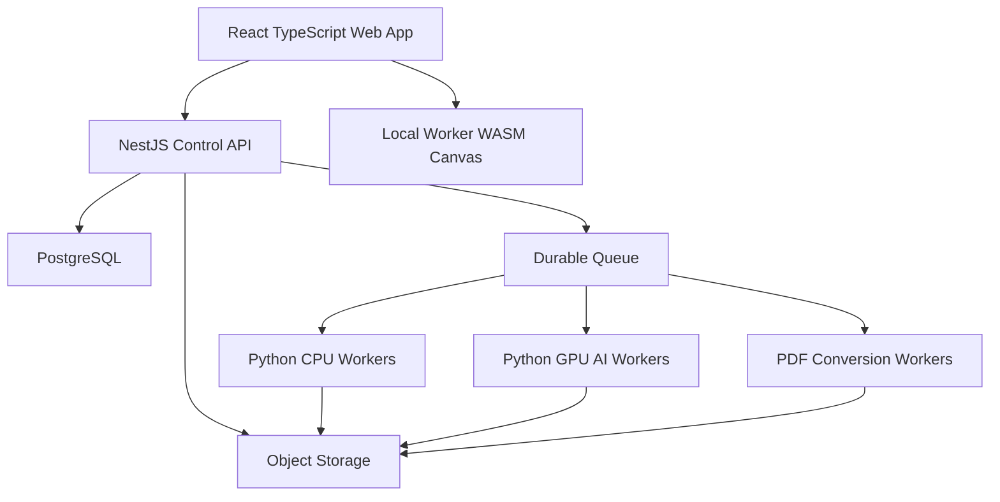

# Recovery Architecture and Delivery Plan

## 1. Recovery decision

Keep the existing verified repository and Git history. Tag/freeze the current customer UI as legacy evidence. Build clean production applications alongside reusable verified packages.

Do not create a disconnected repository and manually copy code. Do not incrementally convert the global-state vanilla-JavaScript UI into the new product.

## 2. Evidence from takeover audit

The audited repository has a clean working tree, 1,703 passing Python tests, approximately 90% coverage, passing Ruff/Mypy/TypeScript checks and verified golden/fixture assets. Reusable candidates include contracts, safe input inspection, deterministic processors, licence gates, storage abstraction, selected PDF redaction primitives, vector tracing and benchmark infrastructure.

Confirmed problems include the narrow home framing, stale UI facts, overlapping Download/Export, weak history, no automated UI tests, synchronous slow processing, runtime coupling to benchmark code, unintegrated queue/database paths, commercially uncleared AI weights and unproven custom PDF compatibility.

## 3. Target topology



## 4. Responsibilities

### React + TypeScript

- Home, projects, editors, canvas, layers, panels, comparison and responsive UX.
- Browser-local preview and approved local operations in workers.
- No direct database/model credentials or direct GPU-worker calls.

### NestJS control plane

- Identity, workspaces, permissions, projects, assets, versions and sharing.
- Signed upload/download authorisation.
- Jobs, idempotency, policy/routing, shadow usage/pricing and audit.
- Public API, OAuth/service credentials and webhooks.
- Cloud connectors and e-sign orchestration.

### Python processing plane

- Safe decode/inspection and deterministic image processing.
- AI inference, tiling, quality metrics and model adapters.
- OCR, reconstruction and specialist conversion where selected.
- Processor facts, provenance and measured resource reporting.
- No customer billing/permission decisions.

### Storage and data

- PostgreSQL stores metadata/workflow state, not large file bytes.
- Object storage keeps immutable originals, derivatives, previews, projects, exports and evidence packages.
- Durable queues support background continuation, retry, checkpointing and dead-letter handling.

## 5. Repository direction

Proposed logical shape; Codex must map it to existing packages without destructive reorganisation:

```text
apps/
  web/                    # new production React application
  workspace-legacy/       # frozen legacy UI or documented legacy location
  browser-lab/            # benchmark lab only
services/
  api/                    # NestJS control plane
  processing-worker/      # Python worker entrypoints
  benchmark-runner/       # development only
packages/
  contracts/              # language-neutral source/generation policy
  contracts-ts/
  processors/
  pdf/
  vector/
  metrics/
docs/
  product-v2/
infra/
```

The exact move/rename sequence requires a Codex plan and must preserve history/tests.

## 6. Reuse gates

Code is reused only when:

- Its purpose maps to V2 requirements.
- Tests cover the intended production behaviour.
- It is not coupled to benchmark-only packages.
- Security boundaries are suitable.
- Code and executed dependencies are commercially approved.
- Inputs/outputs conform to versioned contracts.
- It has owner, documentation and operational telemetry.

The custom PDF engine remains unapproved for production until compatibility, fuzzing, security, signature, forms, layers, fonts, tags and large-real-document tests pass against an established engine baseline.

## 7. Delivery sequence

### Recovery 0 — Preserve and reconcile

- Tag verified baseline.
- Add V2 authority documents.
- Mark legacy/benchmark/runtime boundaries.
- Produce dependency graph and reuse matrix.
- Remove no code.

### Recovery 1 — Production contracts and skeleton

- Versioned project/asset/job/export/error contracts.
- New React shell and NestJS control-plane skeleton.
- Internal worker contract and fake processor.
- CI quality gates and architecture tests.

### Recovery 2 — Identity, workspace, storage and jobs

- Accounts/workspaces/default project.
- Object storage and immutable provenance.
- Durable queue, status, idempotency, trace IDs and checkpoint semantics.
- Shadow usage ledger with effective zero charge.

### Recovery 3 — Home and intelligent intake

- Guest/signed-in home.
- Upload/cloud intake shell.
- Upload Intelligence and safe preview.
- Customer-visible diagnostics.

### Recovery 4 — Unified editor foundation

- Canvas/document schema, layers, artboards, panels, autosave, undo/redo and versions.
- Contextual/dockable AI assistant contract.
- UI/end-to-end/visual/accessibility tests.

### Recovery 5 — Image & Graphic Studio

- Safe corrections, region protections and comparisons.
- Restore/Recreate approval and candidate workflow.
- Export Center, digital profiles and batch board.
- Model integrations only after licence/quality gates.

### Recovery 6 — Print & Production

- Profile schema, preflight, override audit and optional proofs.
- Textile/factory validation with domain users.

### Recovery 7 — Create PDF

- Pages, layers, master sections, OCR/searchable text, accessibility and multi-profile export.

### Recovery 8 — Edit & Manage PDF

- Capability report, manage/edit views, font resolver, safe signed-PDF behaviour, redaction/sanitisation, repair/compress/convert.

### Recovery 9 — Collaboration and connectors

- Permissions/inheritance, locks/comments/approvals/sharing.
- Drive, SharePoint/OneDrive and Dropbox.

### Recovery 10 — E-sign and public API completion

- Native envelopes, signing portal, evidence, provider adapters, API/webhooks.

### Recovery 11 — Hardening and staged test release

- Full quality matrix, security review, DR restore, performance/large-file proof, licence release gate and staged cohorts.

Each recovery stage is a reviewable production slice, not permission to implement all stages at once.

## 8. Immediate first task

The first Codex task is read-only planning plus documentation integration:

1. Verify the current repository state still matches the audit.
2. Read the entire V2 authority set.
3. Map existing folders/packages to Keep, Repair, Refactor, Replace, Archive or Remove-later.
4. Propose the exact Recovery 0 diff and Git/tag/branch sequence.
5. Identify contradictions and decisions requiring approval.
6. Do not implement runtime/frontend changes until the plan is approved.
